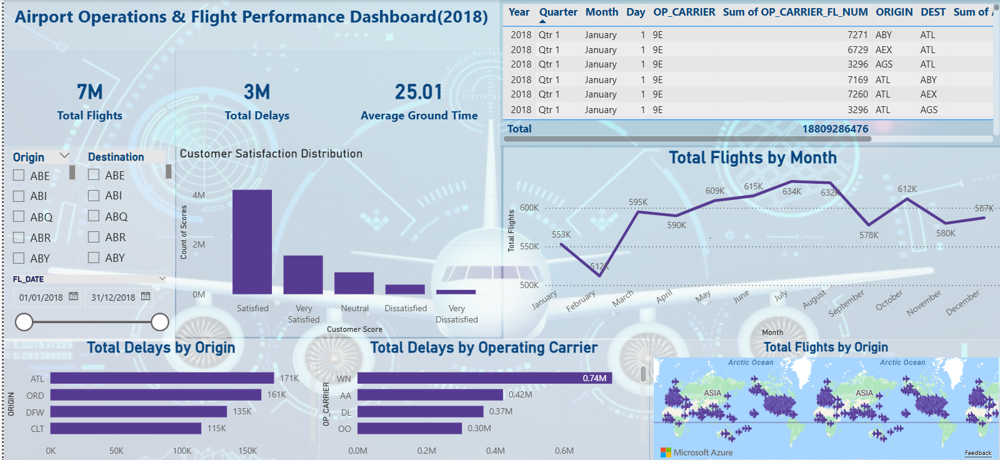
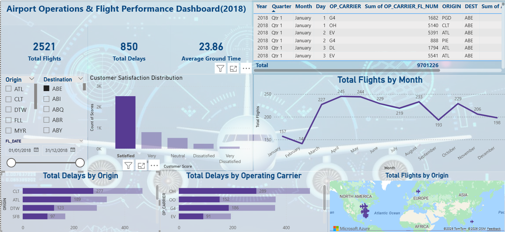

# Airport Operations & Flight Delay Analytics Dashboard

## Project Overview
This project presents an interactive Power BI dashboard for analyzing airport operations and flight delay performance using 2018 airline operations data. The dashboard was developed as a Business Intelligence case study to help airport management understand flight activity, delays, ground processing performance, and passenger feedback.

The main goal of this project is to transform airport operation data into clear visual insights that support data driven decision making.

---

## Project Objectives
- Analyze total flight activity, including incoming and departing flights
- Identify arrival and departure delays
- Evaluate ground processing time
- Include passenger feedback insights
- Enable filtering by time period, source airport, and destination airport
- Support drill down analysis for selected flight periods

---

## Dataset
- Dataset type: Airline delays and cancellation data
- Year used: 2018 only
- Source: Kaggle
---

## Dashboard Features
The Power BI dashboard includes:

- KPI cards for total flights and delays
- Flight delay analysis by category
- Ground processing time analysis
- Passenger feedback summary
- Source and destination filters
- Time period slicers
- Drill down capability for flight level details

---

## Tools and Technologies
- Power BI
- Power Query

## Screenshots

## Key Insights
- Flight activity and delay patterns can be monitored using KPI cards and trend visuals
- Delay analysis helps identify operational bottlenecks
- Ground processing time provides insight into airport efficiency
- Passenger feedback supports service-quality evaluation
- Interactive filters allow users to explore specific routes, sources, destinations, and time periods

---

## Author
Zainularab Zarabi
